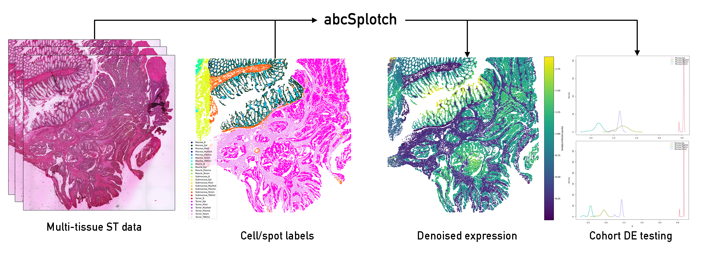

# abcSplotch
Approximate Bayesian inference of spatial cellular gene expression conditioned on sample covariates. 

## Features:
- Uses generalized linear model to denoise gene expression, disentangling effects of cell type, sample covariate, and local spatial autcorrelation
- Quantifies cohort-level differential expression across sample covariates and/or cell types 
- Efficient inference via integrated nested Laplace approximation (INLA) scales to tens of millions of spots/cells
- Compatible with Visium HD, Visium v1/v2, and original STv1
- Enables deconvolution of multi-cellular data (Visium v1/v2, STv1) via per-spot cellular composition estimates



## Installation

### 1. Clone the repository

```bash
git clone https://github.com/nygctech/abcSplotch.git
cd abcSplotch
```

---

## Python Environment Installation

The preprocessing and downstream analysis tools are distributed as a Python package and are intended to run inside a Conda/Mamba environment.

We strongly recommend using `mamba` (or `micromamba`) with the `conda-forge` channel.

### Create the environment

```bash
mamba env create -f environment.yml
```

Activate the environment:

```bash
conda activate abcsplotch
```

---

## Install the Python Package

Install the repository in editable mode:

```bash
pip install -e . --no-deps
```

This will:

- install the `abcSplotch` Python package
- create command-line executables from the package entry points
- keep the installation linked to the local repository for development

The `--no-deps` flag prevents `pip` from attempting to reinstall scientific dependencies already managed by Conda/Mamba.

### Verify installation

```bash
splotch_prepare_count_files --help
splotch_generate_input_files --help
```

or

```bash
python -c "import splotch"
```

---

## R-INLA / Apptainer Backend

The Bayesian inference backend relies on a containerized R-INLA environment distributed via Docker/Apptainer.

We recommend using the provided Apptainer image directly on HPC systems.

---

### Building the Apptainer Image

### Build the Docker image

From the `containers/` directory:

```bash
cd containers

docker build -t abcsplotch-rinla:latest .
```

---

### Convert Docker image to Apptainer `.sif`

```bash
apptainer build \
    abcsplotch-rinla_latest.sif \
    docker-daemon://abcsplotch-rinla:latest
```

This produces a portable, immutable Apptainer image suitable for HPC execution.

---

### Optional: Create a Writable Sandbox

For debugging or interactive development:

```bash
apptainer build \
    --sandbox abcsplotch-rinla.sandbox \
    abcsplotch-rinla_latest.sif
```

Note that sandbox containers are mutable and therefore less reproducible than `.sif` images.

---

### Running the R-INLA Backend

Example:

```bash
apptainer exec \
    abcsplotch-rinla_latest.sif \
    Rscript /opt/abcSplotch/scripts/run_model.R \
    input.rdat \
    output_dir
```

The Python command-line tools can also be configured to launch the containerized backend automatically.

---

## HPC Notes

Many HPC environments prohibit Docker execution directly on compute nodes. The recommended workflow is therefore:

1. Build Docker image locally or on a build node (must have x86 architecture)
2. Convert to Apptainer `.sif`
3. Transfer `.sif` to the cluster
4. Execute with `apptainer exec`

The `.sif` image is self-contained and reproducible across systems supporting Apptainer/Singularity.

---
